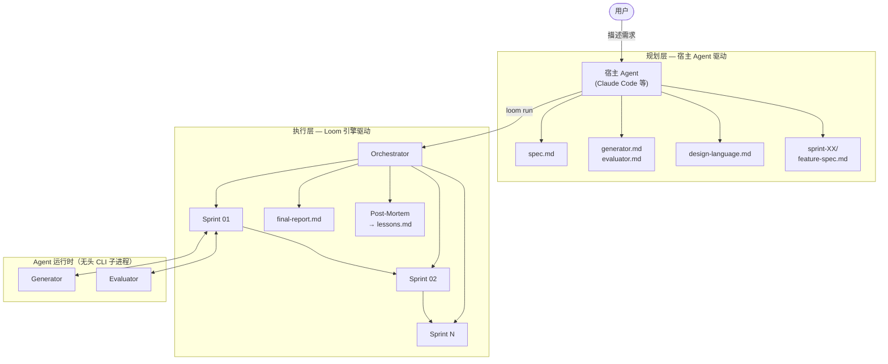
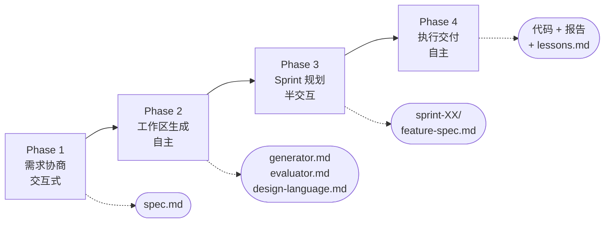
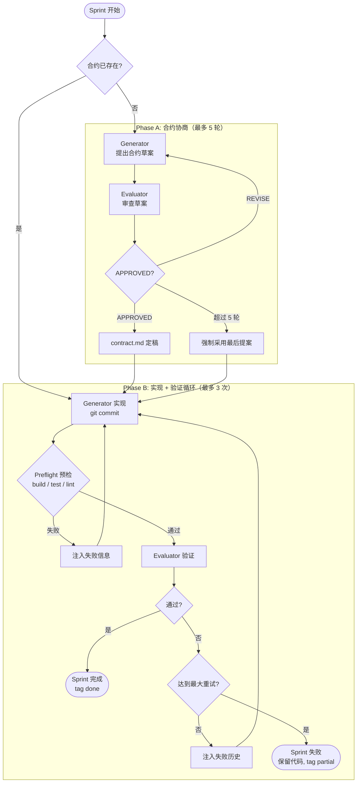
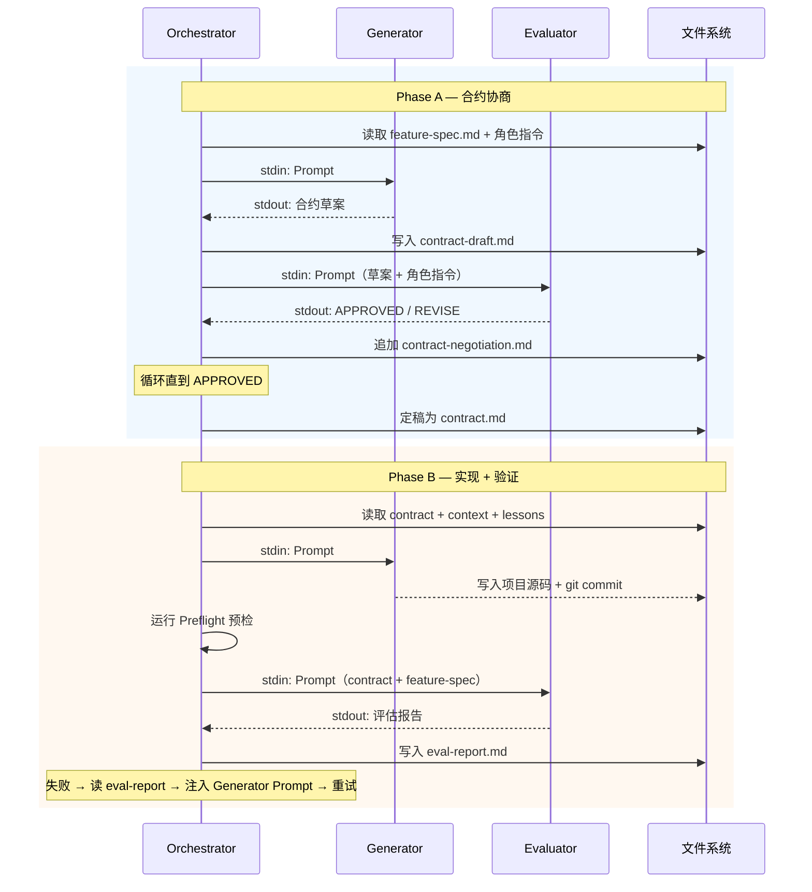
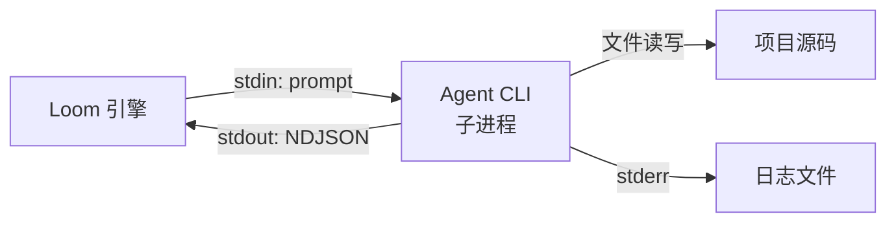
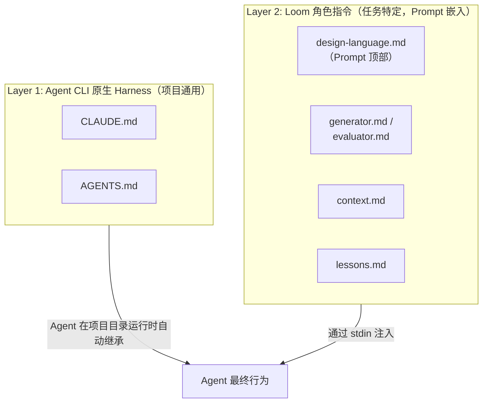
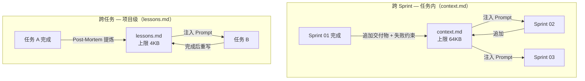
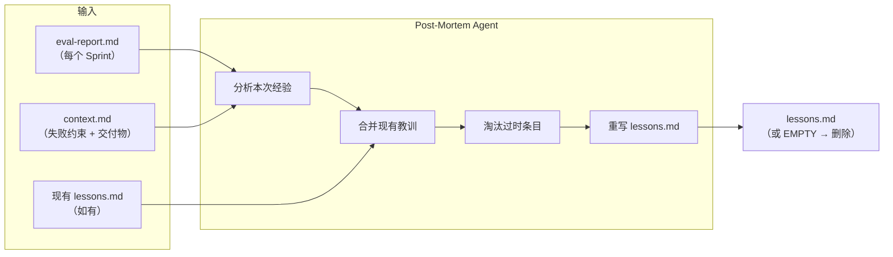

# Loom 架构设计文档

自主多 Agent 实现引擎。宿主 Agent 负责规划（Phase 1-3），Loom 负责执行（Phase 4）。

---

## 1. 设计决策

**规划与执行分离** — 宿主 Agent（Claude Code 等）拥有完整对话上下文，适合做需求理解和规划。Loom 是纯循环引擎，不理解意图，只按合约执行和验证。

**零 SDK 依赖** — 通过子进程调用无头模式的 Coding Agent CLI。Agent 自动继承项目 harness（CLAUDE.md / AGENTS.md），无需 Loom 额外配置。

**文件系统即通信** — Agent 之间不直接对话。Orchestrator 读文件 → 拼 Prompt → 调 Agent → 拿 stdout → 写文件。所有中间产物可审计、可回放。

---

## 2. 整体架构



| 层 | 谁驱动 | 做什么 |
|---|---|---|
| **规划层** | 宿主 Agent | 理解需求、设计角色、拆分 Sprint |
| **执行层** | Loom 引擎 | 合约协商 → 编码 → 验证 → 修复 → 交付 |

---

## 3. 四阶段工作流



### Phase 1: 需求协商（交互式）

与用户多轮对话，将模糊意图**扩展**为结构化 `spec.md`。

核心原则：
- **约束交付物，不约束路径** — 描述"要做什么"，不描述"怎么实现"
- **"不做什么"比"做什么"更重要** — 明确排除项防止范围蔓延
- **设计语言** — 一句话隐喻定义代码审美目标，是整个框架中最高杠杆的输入

### Phase 2: 工作区生成（自主）

分析项目（技术栈、编码约定、质量工具链），生成角色文件：

| 文件 | 作用 | 消费者 |
|------|------|--------|
| `design-language.md` | 代码审美校准（❌/⚠️/✅ 三级范例） | Generator + Evaluator |
| `generator.md` | 编码策略 + 协商职责 + 实现职责 | Generator |
| `evaluator.md` | 验证策略 + 质量门 + 审查纪律 | Evaluator |

`design-language.md` 可选但强烈推荐 — 存在时注入所有 prompt 顶部（primacy effect）。

### Phase 3: Sprint 规划（半交互）

将 spec 分解为可独立验证的 Sprint。按功能模块拆分（非技术层），第一个 Sprint 是基础设施。Feature Spec 只描述 What，验证方案由合约协商决定。

### Phase 4: 执行交付（自主）

调用 `loom run <task-name>` 进入自主循环。由 Orchestrator 串行执行每个 Sprint，完成后生成最终报告和 Post-Mortem。

---

## 4. Sprint 执行引擎

Sprint 是 Loom 的核心执行单元。每个 Sprint 经历合约协商和实现验证两个阶段，Sprint 之间严格串行。



### 4.1 合约协商

Generator 和 Evaluator 多轮协商，将 `feature-spec.md` 细化为可验证的 `contract.md`。

**合约中的验收标准分类**：

| 类型 | 标记 | 验证方式 | 示例 |
|------|------|----------|------|
| BEHAVIORAL | `[PREFLIGHT]` | 引擎执行命令，exit code 判定 | `bun test`、`npx tsc --noEmit` |
| STRUCTURAL | `[PREFLIGHT]` | 引擎执行单条 grep/find，exit code 判定 | `grep -r "export.*Router" src/routes/` |
| DESIGN | 无标记 | Evaluator 读代码判断 | 对照 design-language.md 审查 |

**协商优化**：
- **历史窗口化** — Prompt 只含最新提案 + 最新反馈，避免 O(n²) token 膨胀
- **增量持久化** — 每轮追加 `contract-negotiation.md`，草案写入 `contract-draft.md`，通过后重命名为 `contract.md`

### 4.2 实现验证循环

| 机制 | 说明 |
|------|------|
| **Preflight 预检** | `[PREFLIGHT]` 标记的 AC 由引擎直接执行（build/test/lint），失败跳过 Evaluator，节省 Agent 调用 |
| **失败记忆累积** | 每次失败的 AC 提取后注入下一轮 Generator prompt，附带 "DO NOT REPEAT THESE MISTAKES" |
| **评估收敛** | Attempt 1 全量评估；Attempt 2+ 只验证之前的失败项 + 回归检查 |
| **设计专项重试** | 行为 AC 全部通过但设计不达标 → Generator 只做重构，不改功能逻辑 |

---

## 5. Agent 通信

Agent 之间不直接对话。Orchestrator 充当中间人。



**通信通道**：

| 通道 | 方向 | 格式 |
|------|------|------|
| Markdown 文件 | 持久化（合约、评估报告、上下文） | `.md` |
| Prompt 嵌入 | Orchestrator → Agent stdin | 纯文本拼接 |
| stdout 捕获 | Agent → Orchestrator | NDJSON 事件流 |
| git tag | 状态标记 | `loom/<task>/<sprint>/{start,done,partial}` |

---

## 6. Agent 运行时

每次 Agent 调用都是全新子进程。Prompt 通过 stdin 喂入，stdout 捕获为响应。



### 支持的运行时

| 预设 | CLI | 无头模式参数 | 流式格式 |
|------|-----|-------------|----------|
| claude | `claude` | `-p --dangerously-skip-permissions --output-format stream-json --verbose` | stream-json |
| codex | `codex` | `exec --dangerously-bypass-approvals-and-sandbox --ephemeral --json -` | JSONL |
| gemini | `gemini` | `--yolo -p "" -o stream-json` | stream-json |

Generator 和 Evaluator 可以使用不同的运行时：

```bash
loom run auth --generator-runtime=claude --evaluator-runtime=codex
```

优先级：`--generator-runtime` / `--evaluator-runtime` > `--runtime` > `LOOM_RUNTIME` 环境变量 > 自动检测 PATH（claude → codex → gemini）

### 流式解析

每个 Agent 适配器（`src/agents/`）实现两个函数：

- `parseStreamLine(line)` — 解析 stdout 单行 NDJSON，提取进度事件（tool_use / tool_result / text / turn_complete）
- `extractFinalResponse(lines)` — 从完整输出中提取最终文本响应

新增运行时只需实现这两个函数 + 声明 CLI 参数。

### 双层 Prompt 叠加

Agent 的最终行为由两层叠加：



---

## 7. 知识传递

两层知识传递机制，确保经验在 Sprint 之间和任务之间不丢失。



### context.md — 跨 Sprint（任务内）

每个 Sprint 完成后追加交付物摘要和失败约束。后续 Sprint 的所有 Agent Prompt 都包含此文件。

- 即使 Sprint 最终成功，过程中的失败约束也保留（对后续 Sprint 有价值）
- 超过 64KB 时在 `##` 标题边界处截断旧内容

### Post-Mortem → lessons.md（跨任务）

每个任务完成后（无论成功或失败），Orchestrator 执行 Post-Mortem 分析。这是一次独立的 Agent 调用（使用 Evaluator 运行时），输入本次任务的全部评估报告和跨 Sprint 上下文，输出项目级通用教训。



**执行细节**：

1. 收集本次任务所有 Sprint 的 eval-report.md（每份截取前 2000 字符）
2. 加载 context.md（跨 Sprint 失败约束，截取前 3000 字符）
3. 加载现有 lessons.md（如有）
4. 构建 Post-Mortem prompt，调用 Evaluator Agent 分析
5. Agent 输出新的 lessons.md 内容（或 `EMPTY` 表示无有效教训）
6. 强制 4KB 上限截断，写入 `~/.loom/projects/<project>/lessons.md`

**筛选标准**：

| 保留 | 不保留 |
|------|--------|
| 环境/工具链约束（"用 Bun 不用 Node"） | 本次任务的实现细节 |
| 代码规范/架构模式（"API 返回 {data, error}"） | 一次性 bug 修复 |
| 反复出现的陷阱（"迁移后必须跑 seed"） | 特定任务的 workaround |

**自然衰减机制**：

- 每条带 `[YYYY-MM-DD]` 日期标记 — 代表最后验证时间
- 每次**重写整份文件**（非追加）— Agent 判断旧教训是否仍然有效，有效则更新日期，过时则删除
- 上限 4KB — 强制精炼，空间压力自然淘汰低价值条目
- Agent 判定无有效教训时输出 `EMPTY` — 删除 lessons.md，不硬凑内容
- Post-Mortem 失败不阻塞任务完成（non-fatal）

**注入时机**：新任务启动时，lessons.md 内容注入所有 Generator 和 Evaluator 的 prompt，使后续任务继承项目级经验。

示例：
```markdown
# Project Lessons

## Environment & Toolchain
- [2026-04-09] 运行时是 Bun，不兼容部分 Node API（如 vm 模块）

## Known Pitfalls
- [2026-04-05] seed 必须在迁移后跑，否则外键约束报错
```

---

## 8. 对抗性审查

> *"Out of the box, Claude is a poor QA agent. I watched it identify issues, then talk itself into deciding they weren't a big deal and approve the work anyway."* — Anthropic

Loom 在多个层面防止 Agent "放水"。

### Evaluator 纪律

| 纪律 | 说明 |
|------|------|
| 禁止自我说服 | 发现问题即报告，严重度判定后不降级 |
| 禁止表面通过 | "应用启动了" ≠ 功能正确，必须执行验证命令并检查输出 |
| 禁止信任 Generator | Generator 声称"已实现"不算数，独立验证每个功能 |
| Stub 检测 | placeholder、hardcoded 返回值、TODO → 该 AC 立即 FAIL |
| Anti-gaming | 测试存在但不执行被测逻辑、输出匹配但原因是硬编码 → 立即 FAIL |

### 标准质量门

合约协商阶段强制纳入的 AC：

| 质量门 | 类型 | 验证内容 |
|--------|------|----------|
| QG-1: 边界值安全 | BEHAVIORAL [PREFLIGHT] | 数值转换防御 NaN 和 falsy 陷阱 |
| QG-2: 测试覆盖质量 | BEHAVIORAL [PREFLIGHT] | happy path + 至少一个 error path |
| QG-3: 共享类型归属 | DESIGN | 被 3+ 文件 import 的类型必须在独立 types 文件 |
| QG-4: 测试真实性 | BEHAVIORAL [PREFLIGHT] | 测试真正执行被测代码路径 |

### 设计语言校准

`design-language.md` 提供三级代码范例，让审查有客观锚点：

| 等级 | 含义 | 判定 |
|------|------|------|
| ❌ 不达标 | 能跑但有结构性问题 | FAIL |
| ⚠️ 及格 | 基本合理但有短板 | NOTE（首次），重试后仍停留则 FAIL |
| ✅ 达标 | 本项目的标准 | PASS |

三个版本功能等价、都能跑，差异在设计质量。范例必须来自项目实际技术栈。

---

## 9. 存储架构

所有 Loom 数据集中存储在 `~/.loom/`，项目目录只保留 `.loom` 软链接（自动 gitignore）。

```
~/.loom/
├── index.json                           # 全局项目索引
└── projects/
    └── <project-name>/
        ├── lessons.md                   # 项目级教训（跨任务）
        └── <task>/
            ├── spec.md                  # Phase 1 产出
            ├── design-language.md       # Phase 2 产出（可选）
            ├── generator.md             # Phase 2 产出
            ├── evaluator.md             # Phase 2 产出
            ├── project-plan.md          # Phase 3 产出
            ├── state.json               # 任务状态机
            ├── context.md               # 跨 Sprint 上下文
            ├── sprint-XX/
            │   ├── feature-spec.md      # Phase 3 产出
            │   ├── contract.md          # 协商定稿
            │   ├── contract-negotiation.md  # 协商过程
            │   └── eval-report.md       # 最终评估报告
            ├── final-report.md          # 交付报告
            ├── loom-result.json         # 结构化结果
            └── runs/
                ├── loom.log             # 编排事件
                ├── generator.log        # Generator 完整输出
                ├── evaluator.log        # Evaluator 完整输出
                └── sprint-XX/
                    ├── contract-draft.md
                    └── eval-report-attempt-*.md
```

### 项目名称派生

项目名从 git 仓库标识自动派生，确保同一仓库的不同 worktree 共享同一个项目名：

1. 从已有 `.loom` 软链接推导（一致性保证）
2. 通过 `git rev-parse --git-common-dir` 获取主仓库目录名（worktree 兼容）
3. 回退到当前目录名

### 状态机

```typescript
type TaskStatus = "created" | "planning" | "ready" | "executing" | "done" | "failed";
type SprintStatus = "pending" | "negotiating" | "contracted" | "executing" | "passed" | "failed";
```

任务状态持久化在 `state.json`，全局索引维护在 `~/.loom/index.json`。

---

## 10. 安全边界

### 权限模型

所有 Agent 运行在无头模式，权限检查被跳过。安全靠以下机制保障：

- Agent 只在 `projectRoot` 目录工作
- 每次调用都是新进程，互不共享状态
- 全部 Agent 输出写入日志文件供事后审计
- `.loom` 目录自动加入 `.gitignore`

### 流程安全

| 机制 | 环境变量 | 默认值 |
|------|----------|--------|
| Sprint 最大重试 | `LOOM_MAX_RETRIES` | 3 |
| 最大 Sprint 数 | `LOOM_MAX_SPRINTS` | 20 |
| 协商最大轮次 | `LOOM_MAX_NEGOTIATION_ROUNDS` | 5 |
| Agent 调用超时 | `LOOM_AGENT_TIMEOUT_MS` | 1800000 (30 min) |

Sprint 失败时保留代码（`git commit` + `tag partial`），可手动修复或回滚到 `loom/<task>/<sprint>/start`。

---

## 11. 模块结构

```
src/
├── index.ts              # CLI 入口 + 命令路由
├── config.ts             # CLI 参数解析（run/negotiate/execute/status/help）
├── workspace.ts          # 工作区文件加载
├── orchestrator.ts       # 编排器：Sprint 发现 → 执行 → 报告 → Post-Mortem
├── sprint-executor.ts    # 单 Sprint：协商 → 实现 → 验证循环
├── negotiator.ts         # 合约协商引擎（窗口化历史 + 增量持久化）
├── context.ts            # 跨 Sprint 上下文管理（context.md）
├── lessons.ts            # 跨任务知识管理（Post-Mortem → lessons.md）
├── reporter.ts           # 最终报告生成
├── runtime.ts            # Agent 运行时调度（子进程 + 流式解析）
├── state.ts              # 状态持久化 + 项目名派生
├── git.ts                # Git 操作封装（tag/commit）
├── logger.ts             # 日志（控制台 + 文件双写，picocolors 着色）
├── types.ts              # 共享类型 + 运行时常量
└── agents/               # Agent CLI 适配器
    ├── index.ts           # 注册表 + 自动检测
    ├── types.ts           # 适配器接口（AgentRunOptions / AgentRunResult / StreamLineParser）
    ├── claude.ts          # Claude Code（stream-json）
    ├── codex.ts           # Codex CLI（JSONL）
    └── gemini.ts          # Gemini CLI（stream-json）
```

唯一运行时依赖：`picocolors`（终端着色）。

---

## 12. 参考资料

- [Building effective agents](https://www.anthropic.com/research/building-effective-agents) — Generator-Evaluator 模式参考
- [The Design of Claude Code](https://www.anthropic.com/engineering/the-design-of-claude-code) — Evaluator 对抗性审查纪律的设计来源
